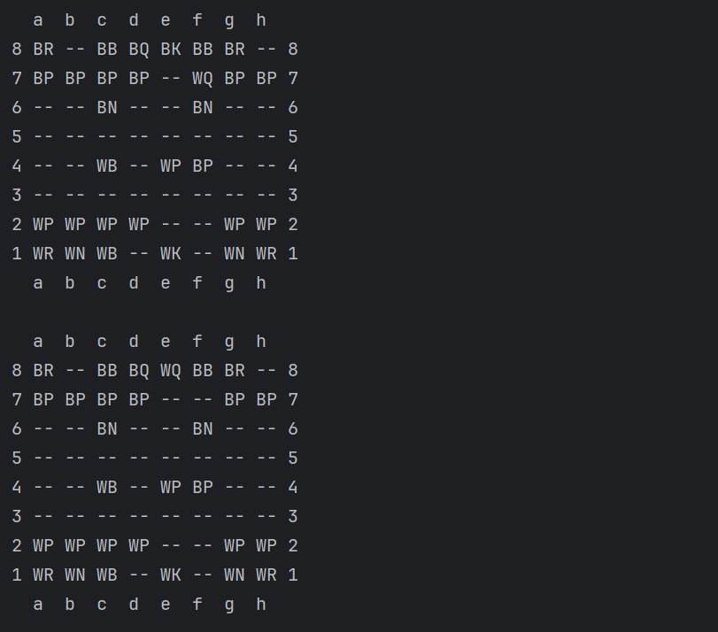

# Chess

This is machine coding solution for chess game with full working code

This is the solution to question

https://workat.tech/machine-coding/practice/design-chess-validator-to77d8oqpx2h

It satisfies all the requirement mentioned in the problem statement of it

1. Print the board after initializing.
2. Allow the user to make moves on behalf of both the players.
   The user will make a move by entering the start position and the end position.
   You need to determine the piece and make the move if it is valid.
   - Valid move:
      - The piece is controlled by the player having the current turn
      - The move is valid based on how that particular piece can move
      - The start and end position are inside the board
   - If the move is invalid
      - print 'Invalid Move'
      - the same player plays again
   - If the move is valid:
      - move the piece to the destination and remove any captured piece
      - print the board after the move
3. The position of a piece is represented as the column name (a-h) followed by the row number (1-8).
   To run the program simply run the main function and start giving input in valid format.

To test input run the main function
Output of the query against test input

